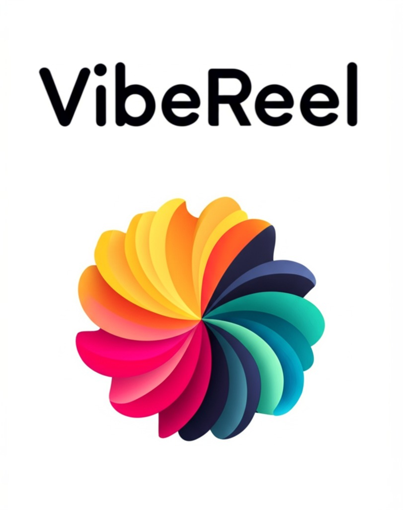

# VibeReel



## Share Your Art. Find Your Vibe. Get Vibed.

A creative community for artists to share and discover art that resonates with their unique aesthetic. Built for creators who believe art is more than just images - it's about finding your tribe through shared creative energy.

### Who It's For

- **Visual Artists** looking to connect with like-minded creators
- **Digital Creators** wanting to showcase their work in meaningful collections
- **Art Enthusiasts** eager to discover fresh perspectives and support emerging talent
- **Creative Communities** building connections through shared aesthetic sensibilities

### How VibeReels Work

The core feature of this app is the **VibeReel** mechanic - a way to create and share artistic narratives:

1. **Create Your Art** - Share your original artwork with the community
2. **Curate Your Vibe** - Select complementary pieces from other artists that match your aesthetic
3. **Build Your Story** - Combine your art with others' to create short, visual story collections called VibeReels
4. **Share the Energy** - Post your VibeReels to friends and watch your creative network grow

### Getting "Vibed"

When another artist includes your work in their VibeReel, you've been **"Vibed"** - a sign that your art resonates with others in the community. You can track your Vibes to see who's connecting with your work and discover artists with similar aesthetics.

## Prerequisites

- **Node.js** (v18 or later) - [Download here](https://nodejs.org/)
- **Expo Go app** on your phone ([iOS](https://apps.apple.com/app/expo-go/id982107779) | [Android](https://play.google.com/store/apps/details?id=host.exp.exponent))

## Installation

1. Clone the repository:

```bash
git clone https://github.com/Bishibop/snapconnect.git
cd snapconnect
```

2. Install dependencies:

```bash
npm install
```

3. Set up environment variables:

```bash
cp .env.example .env
# Edit .env and add your Supabase credentials
```

## Running the App

Start the Expo development server:

```bash
npm start
```

This will display a QR code in your terminal. Open the **Expo Go** app on your phone and scan the QR code to run the app.

### Alternative Commands

- `npm run android` - Run on Android emulator
- `npm run ios` - Run on iOS simulator
- `npm run web` - Run in web browser
